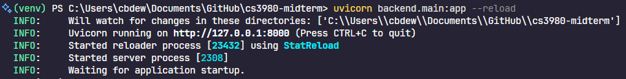
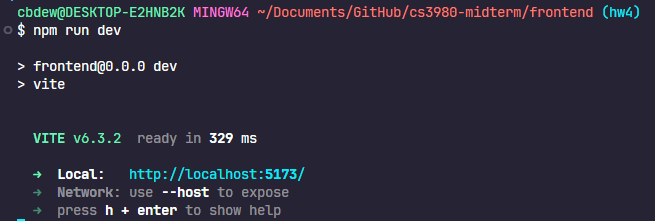

# cs3980-hw4

## Overview

For HW4, we were tasked to intergrate our midterm projects with MongoDB, so that our app uses a real database to persist data, rather than an in-memory list. In doing so, we were also asked to implement a User Login feature.

I have kept my midterm project the same, with the addition of these new features.

## How to Demo

### 1. Clone the Repository

First off, clone this repository and open it using whatever IDE you see fit.

### 2. Setup Virtual Environment

Next, you'll need to setup a virtual environment for this project, and install all necessary packages.

For Windows, input these commands into the terminal to create and activate :

```powershell
python -m venv venv
.\venv\Scripts\activate
```

For MacOS:

```bash
python -m venv venv
source ./venv/bin/activate
```

Next, you'll need to install all packages used in the project, in your terminal, input this command:

```powershell
pip install -r requirements.txt
```

Now your virtual environment is ready to demo the project!

### 3. Install React and its Dependencies

Next, you'll need to install React and its dependencies.

Create a separate Git Bash shell (or just zsh if on MacOS)

```bash
cd frontend
npm install
```

**NOTE:** You only need to do "npm install" on your first demo

### 4. Launch the app

Since I am using React, the frontend and backend will run on separate ports.

For the backend, execute this from the **Project Root**:

```powershell
(venv)$ uvicorn backend.main:app --port 8000 --reload
```

It is **ESSENTIAL** that it is run in the root, and that it is backend.main:app, instead of main:app, otherwise my FastAPI server will not start due to the imports in the backend.

The terminal will then launch the app, and prompt you with this text:

Hold down control (command on MacOS), and click on **http://127.0.0.1:8000**, this will open up the app in your preferred browser. It will open a blank screen, this is totally normal, I would suggest just going to http://127.0.0.1:8000/docs to the Swagger documentation, but its entirely up to you.

For the frontend, go into the git bash (or zsh) terminal from before.

Make sure you are in the frontend folder, and input this

```bash
cd frontend
npm run dev
```

The terminal will launch the frontend, and prompt you with this text:

Once again, hold down control (command on MacOS), and click **http://localhost:5173/**. This will open up the frontend of the application, and you are ready to demo!

## How To Use The App

As mentioned before, the main purpose of the application is to create CRUD API endpoints. Here is how you can use each aspect (Create, Read, Update, Delete) in the app.

### Create

To add a new scheduled payment, simply click the "Add New Payment" button, where the user will then be prompted to create a new payment.

Once the modal is filled out, the payment will appear in the UI.


### Read

After a payment is added, a GET request is made to the API so it can display the updated payments, which satisfies the READ requirement. In fact, anytime a payment is added, deleted, or updated, a GET request is made to ensure the proper data is being displayed.

### Update

Any payment can be updated when by clicking  icon at the bottom of the payment.
The user will be prompted with the same modal as when they added a payment, where they can then edit it as desired.

In this example, I changed the due date. Notice the OVERDUE text next to the due date, this will show whenever a payment is in the "Not Paid" state after the due date passes.

### Delete

To delete a payment, click the  icon at the bottom of the payment. The user will be prompted to confirm the deletion, and once confirmed, the payment will be removed from the list.

### Login and Registration

The login and registration is pretty self explanatory. If you are a new user, create an account, if not, login to your existing account. The only payments that will show up will be that of whoever is logged in.

## Code

### Frontend

The frotned of this project was built with React. The payment page itself is loosely based off of Proffesor Xu's todo app, with some modifications to tge methods and structure for each payment. Some of the styling was used from Bootstrap, and some of it vanilla. In the midterm, I used XHR api calls, but I switched to fetch because I feel I have a better understanding for it now.

### Backend

The backend was made in Python, and uses FastAPI. The code is very similar to that of our demo in class, but I added more fields in Payment to account for additional user information that is needed.
